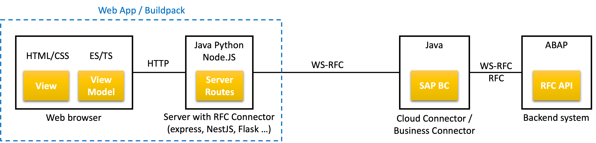

# Fundamental Library for ABAP <!-- omit in toc -->

[](https://www.npmjs.com/package/abap-api-tools)
[](https://www.npmjs.com/package/abap-api-tools)

[](https://api.reuse.software/info/github.com/SAP/fundamental-tools)
[](https://www.npmjs.com/package/abap-api-tools)
[](https://www.typescriptlang.org/)
[](https://github.com/prettier/prettier)
[](https://join.slack.com/t/ui-fundamentals/shared_invite/enQtNTIzOTU0Mzc2NTc5LWQzZWI5MWFhYjE5OTc4YzliN2JhOTc1ZjQxZTg1YjZiMWZiYzRkNjMwYzgyMmFkYmNhZDVjMWE5MDIzOWEzMmM)

Build powerful on-premise and cloud extensions of any ABAP system, with minimum coding efforts and maximum performance.

This repository provides two NPM packages

- [abap-api-tools](./abap-api-tools/README.md) design-time CLI, to enrich your ui componebts with ABAP metadata: data type, length, data binding, user defaults, Value Helps ...
- [abap-value-help](./abap-value-help/README.md) run-time API for generic ABAP Value Helps

used to build cloud extensions of ABAP backend systems, using

- Popular web frameworks and design systems:
  - [Angular, React, Vue etc. with SAP design system](https://sap.github.io/fundamental/#libraries)
  - [Angular, React, Vue etc. with Microsoft design system](https://www.fast.design/docs/category/integrations/)
  - [UI5 web components](https://sap.github.io/ui5-webcomponents/), [UI5 web components for React](https://sap.github.io/ui5-webcomponents-react)
- and any server framework
  - [SAP Cloud SDK for JavaScript](https://sap.github.io/cloud-sdk/docs/js/overview)
  - [SAP Cloud Applications Programming Model](https://cap.cloud.sap/)
  - express, NestJS, Flask, Koa, Spark, Jooby, Django, Pyramid, Tornado ...

The web frameworks "etc" under means practically any web framework because [configurable](abap-api-tools/README.md#custom-ui-configurations) by developer.

Few pre-configured docker containers with RFC connectivity are provided in [docker](./docker/) folder

## Content <!-- omit in toc -->

- [Prerequisites](#prerequisites)
- [Download and installation](#download-and-installation)
- [Usage](#usage)
- [Deployment](#deployment)
- [Known Issues](#known-issues)
- [Getting Support](#getting-support)
- [Contributing](#contributing)
- [Code of Conduct](#code-of-conduct)
- [License](#license)

## Prerequisites

- Backend: ABAP system on-premise or in the cloud (like SAP S/4HANA Cloud or Steampunk)
- Frontend: Web app built using above mentioned frameworks
- No run-time dependencies. Check respective web and server frameworks, mentioned above, for their dependencies and prerequisites
- Web components "understanding" custom attributes for ABAP metadata and Value Helps are currently [implemented using Aurelia web framework](https://github.com/SAP/fundamental-tools/tree/main/abap-api-tools/sample-application-code/client/src/resources) and can be ported to other web frameworks with much reuse.

## Download and installation

```shell
npm install -g abap-api-tools
```

More info: [abap-api-tools/README.md#download-and-installation](abap-api-tools/README.md#installation)

## Usage

- Cloud extension [example](./doc/app.md)
- [abap-api-tools CLI usage](./abap-api-tools/README.md#usage)

## Deployment

Web applications developed this way can be deployed on-premise or in the cloud. For cloud deployment the connecton parameters are different and cloud services available in cloud only (eg. audit log etc.) are not available on premise.

RFC connectivity from on-premise web application to ABAP system requires platform specific RFC connector

- Java: [SAP JCo](https://support.sap.com/en/product/connectors/jco.html)
- Microsoft NET: [SAP NCo](https://support.sap.com/en/product/connectors/msnet.html)
- Python: [SAP/PyRFC](https://github.com/SAP/PyRFC) open source
- Node.JS: [SAP/node-rfc](https://github.com/SAP/node-rfc) open source


RFC connectivity from cloud Java applications is supported by [SAP Cloud Connector](https://help.sap.com/docs/connectivity/sap-btp-connectivity-cf/cloud-connector). The same support for Node.JS and Python applications is enabled for certain usage scenarios only. The usage scenario shall be therefore aligned with SAP development or custom buildpack can be used as described below.



The custom buildpack includes [SAP NW RFC SDK](https://support.sap.com/en/product/connectors/nwrfcsdk.html) binaries, added to `LD_LIBRARY_PATH`. The application can use [WebSocket RFC](https://blogs.sap.com/2021/07/19/websocket-rfc-rfc-for-the-internet/) connection parameters, to reach ABAP on-premise system with WebSocket RFC support, outside company firewall. If WebSocket RFC protocol is not supported by ABAP system, or connection outside firewall not wanted, the [SAP Business Connector](https://support.sap.com/en/product/connectors/bc.html) shall be installed on-premise, inside the firewall. For more info check SAP blogs

- [WebSocket RFC – RFC For the Internet](https://blogs.sap.com/2021/07/19/websocket-rfc-rfc-for-the-internet/)
- [WebSocket RFC to Cloud Using SAP Business Connector](https://blogs.sap.com/?p=1616280)

## Known Issues

Click [here](https://github.com/SAP/fundamental-tools/issues) to view the current issues.

## Getting Support

If you encounter an issue, you can [create a ticket](https://github.com/SAP/fundamental-tools/issues/new).

## Contributing

If you want to contribute, please check the [CONTRIBUTING.md](CONTRIBUTING.md) documentation for contribution guidelines.

## Code of Conduct

See [Code of Conduct](./CODE_OF_CONDUCT.md)

## License

Copyright (c) 2018 SAP SE or an SAP affiliate company. All rights reserved. This file is licensed under the Apache Software License, version 2.0 except as noted otherwise in the [LICENSE file](LICENSES/Apache-2.0.txt).
