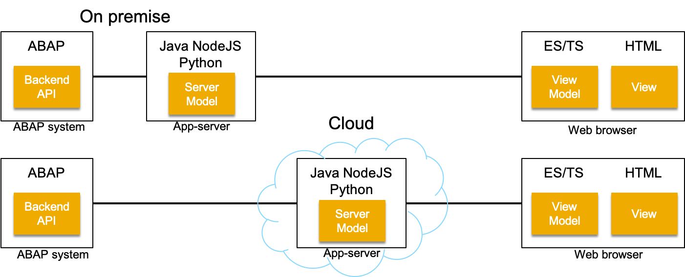

# Fundamental Library for ABAP

[](https://api.reuse.software/info/github.com/SAP/fundamental-tools)

ABAP business logic consumption by [Fundamental Library Styles](https://github.com/SAP/fundamental-styles) frontends:

- Simple and fast
- New and old ABAP systems
- Frontends: Vue, Angular, React, aurelia ...
- Servers: Koa, express, Spark, Jooby, Sanic, Django, Pyramid, Flask, Tornado ...
- Application frameworks: electron, NW.js ...
- On-premise and cloud deployments



## Prerequisites

- ABAP backend: from latest releases, down to 4.6C, with couple of [abap-helpers](/abap-helpers)

- App server platforms: Windows, Linux, macOS, cloud

- App server runtimes:

  - Python with [PyRFC](https://github.com/SAP/PyRFC)
  - NodeJS with [node-rfc](https://github.com/SAP/node-rfc)
  - Java with [SAP Cloud Connector](https://help.sap.com/viewer/cca91383641e40ffbe03bdc78f00f681/Cloud/en-US/e6c7616abb5710148cfcf3e75d96d596.html) or [SAP Java Connector](https://support.sap.com/en/product/connectors/jco.html)

- Development notebook

  - Same as App server
  - VIM, Emacs, IDEA, VSCode ...

- Frontend: modern web browser

:bulb: ABAP Value Input Help run-time component [fundamental-shlp](https://github.com/SAP/fundamental-shelp) for now runs on Python only

:bulb: Design-time tools run on Python and you can use them from docker as well.

## Installation

```shell
git clone https://github.com/SAP/fundamental-tools
```

## Usage

- **ABAP Backend:** Define/implement ABAP backend API as a set of remote-enabled ABAP Function Modules (RFMs), required for Fundamental Library Styles based frontend

* **Server Model:** Expose the backend API via server runtime of choice.

* **View (HTML):**

  - Run the toolset scripts, generating flat-list of annotated SAP Fundamental Style UI elements, with default bi-directional bindings to backend API fields
  - Copy/paste UI elements required for the app, into SAP Fundamental Style layouts and views

- **View Model (ES/TS):** Implement the View Model logic, required for the app.

## Example

To start using the toolset check [Prerequisites](#prerequisites) and clone the project:

```shell
$ git clone https://github.com/SAP/fundamental-tools
$
$ cd fundamental-tools
```

### Example: NodeJS RFM Call Template

A handy CLI tool, providing ABAP RFM call templates: [ffmcall](./tools/rfmcall)

### Example: Backend

Maintain ABAP backend connection parameters in [systems.py](tools/generator/systems.py) and ABAP backend API RFM list in [business_objects.py](tools/generator/business_objects.py), following given examples.

### Example: Server Model

The example below shows Python Flask app server, exposing ABAP backend API for Equipment maintenance app. NodeJS or Java implementations looks almost identical:

```python
# Equipment
@app.route('/equipment/<path:path>', methods=['POST'])
def equipment(path):
    try:
        payload = json.loads(request.data)

        if path == 'get':
            result = client.call('/TEST/API/EQUIPMENT_GET', payload)
        elif path == 'getlist':
            result = client.call('/TEST/API/EQUIPMENT_GETL', payload)
        elif path == 'change':
            result = client.call('/TEST/API/EQUIPMENT_CHANGE', payload)
        elif path == 'install':
            result = client.call('/TEST/API/EQUIPMENT_INSTALL', payload)
        elif path == 'dismantle':
            result = client.call('/TEST/API/EQUIPMENT_DISMTLE', payload)
        else:
            raise Exception('not implemented: %s' % path)

        return to_json(result)

    except Exception as e:
        return serverError(e), 500
```

### Example: View

Run `backend.py` and `frontend.py` scripts:

```shell
$ cd tools
$
$ # read ABAP API metadata into local JSON file; backend connectivity required
$ python backend.py
$
$ # generate annotated HTML UI elements and frontend model initializers (ES/TS)
$ python frontend.py
```

These sripts generate flat lists of UI elements, with default bi-directional binding to ABAP API fields and with custom-attributes, to be interpreted by reusable UI components:

- Data type, length
- Texts (label, caption)
- Unit of measure
- Value Input Help: field domain values, check tables, elementary and complex search helps
- SU3 parameters (User SET/GET parameters)

Attributes can be modified, added or removed manually, from any UI element, no matter of generator default output.

HTML files with annotated UI elements look like:

```html
<!-- prettier-ignore -->
<ui-input value.bind="DATA_GENERAL.DISTR_CHAN" shlp.bind='{"type":"SH", "id":"CSH_TVTW"}'
    data-abap.bind='{"ddic":"CHAR", "type":"string", "length":"2", "mid":"VTW"}'
    label="Distribution Channel">
</ui-input>

<!-- prettier-ignore -->
<ui-checkbox value.bind="DATA_SPECIFIC.READ_CUREF" label="Referenced Configuration"></ui-checkbox>

<!-- prettier-ignore -->
<ui-date date.bind="DATA_FLEET.EXPIRY_DATE" label="Validity end date"></ui-date>

<!-- prettier-ignore -->
<ui-combo value.bind="DATA_GENERAL.COSTCENTER" shlp.bind='{"type":"CT", "id":"CSKS"}'
    data-abap.bind='{"ddic":"CHAR", "type":"string", "length":"10", "mid":"KOS"}' alpha-exit="ALPHA"
    label="Cost Center">
</ui-combo>

<!-- prettier-ignore -->
<ui-combo value.bind="DATA_SPECIFIC.EQUICATGRY" shlp.bind='{"type":"CT", "id":"T370T"}'
    data-abap.bind='{"ddic":"CHAR", "type":"string", "length":"1", "mid":"EQT"}'
    label="Equipment category">
</ui-combo>
```

JS files with View Model initializers of ABAP data structures look like:

```JavaScript
//
// INPUT PARAMETERS
//

// DATA_FLEET BAPI_FLEET Vehicle-Specific Data

/* eslint-disable key-spacing */
// prettier-ignore
DATA_FLEET = {
  CARD_NUM                      : '',  // Fuel card number
  CHASSIS_NUM                   : '',  // Chassis number
  CONSUMP_MOVE                  : '',  // Indicator Consumption Recording: Material Movement
  CONSUMP_TOL                   : '',  // Indicator Consumption Recording: Permitted Tolerances
  DIM_UNIT                      : '',  // Unit of length
  DIM_UNIT_ISO                  : '',  // ISO code for unit of measurement
  ENGINE_CAP                    : 0,  // Engine capacity
  ENGINE_CYL                    : '',  // Number of cylinders
  ENGINE_POWER                  : 0,  // Power at specific number of revolutions per minute
  ENGINE_SNR                    : '',  // Engine serial number of manufacturer
  ENGINE_TYPE                   : '',  // Engine type
  EXPIRY_DATE                   : '',  // Validity end date
  FLEET_HGT                     : 0,  // Maximum fleet object height
  FLEET_LEN                     : 0,  // Maximum fleet object length
```

Copy/paste UI elements required for the app, into [Fundamental Library Styles](https://sap.github.io/fundamental-styles/layouts/index.html) layouts. Elements can be of course modified, or written from scratch,

```html
<!-- prettier-ignore -->
<section class="fd-section">
    <!-- prettier-ignore -->
    <ui-input value.bind="DATA_GENERAL.DISTR_CHAN" shlp.bind='{"type":"SH", "id":"CSH_TVTW"}'
        data-abap.bind='{"ddic":"CHAR", "type":"string", "length":"2", "mid":"VTW"}'
        label="Distribution Channel">
    </ui-input>

    <!-- prettier-ignore -->
    <ui-checkbox value.bind="DATA_SPECIFIC.READ_CUREF" label="Referenced Configuration"></ui-checkbox>

    <!-- prettier-ignore -->
    <ui-date date.bind="DATA_FLEET.EXPIRY_DATE" label="Validity end date"></ui-date>
</section>
```

### View Model

The frontend works with ABAP data structures, in JSON format and the Equipment model is implemented manually, with methods like:

```JavaScript
import { UIApp, UIHttp, UIUtils } from '../../resources/index';

export class Equipment {
  static inject = [UIApplication, UIHttpService];
  static __bizDocType = 'BUSEQUI';
  constructor(app, httpService) {
    this.app = app;
    this.httpService = httpService;
    this.reset();
  }

  getlist() {
    this.list = [];
    return this.httpService
      .backend('/equipment/getlist', {
        IV_PLANT: '1000'
      })
      .then(FROM_ABAP => {
        this.list = FROM_ABAP.ET_EQUIPMENT;
      })
      .catch(error => {
        this.reset();
        this.app.toastError(error);
      });
  }

  save() {
    // set X-fields
    let header = [
      'MANFACTURE',
      'MANMODEL',
      'MANPARNO',
      'MANSERNO',
      'MAINTPLANT',
      'OBJECTTYPE',
      'ABCINDIC',
      'WORK_CTR'
    ];
    let specific = ['EQUICATGRY', 'READ_FLOC'];
    this.IS_HEADER_X = UIUtils.abapStructDiff(this.ES_HEADER, this.IS_HEADER, header);
    this.IS_SPECIFIC_X = UIUtils.abapStructDiff(this.ES_SPECIFIC, this.IS_SPECIFIC, specific);
    // characteristics
    let itChar = [];
    for (let chGroup of this.Characteristics) {
      for (let ch of chGroup.CHARLIST) {
        itChar.push({
          CLASS: ch.CLASS,
          CHARACT: ch.NAME_CHAR,
          VALUE: ch.VALUE,
          VALUE_FROM: ch.VALUE_FROM,
          VALUE_TO: ch.VALUE_TO
        });
      }
    }

// get ...
```

### ABAP API + Server Model + View Model + View = App

Fully functional app, shown below, implemented with ca. 400 lines of code:

| App Component                   |     LoC |
| ------------------------------- | ------: |
| Server Model (Node/Java/Python) |      20 |
| View (HTML)                     |     172 |
| View Model (ES/TS)              |     213 |
| **Total**                       | **405** |

Features:

- Equipment display/update
- Grouped and ungrouped Classifications/Characteristics display/update
- Attachments preview/upload/download

The implementation is under full developer's control, without any magic added by this toolset.


## ALPHA Exits

Conversion exits for a given RFM set are parsed by `alpha.py` script:

```shell
$ python alpha.py
$ cat data/<rfm set>/Alpha.json
    "/COE/RBP_PAM_FUNC_LOC_GETLIST": [
        {
            "convexit": "TPLNR",
            "field": "FUNCTLOCATION",
            "parameter": "ET_FUNC_LOC_LIST"
        },
        {
            "convexit": "TPLNR",
            "field": "SUPFLOC",
            "parameter": "ET_FUNC_LOC_LIST"
        },
        {
            "convexit": "ALPHA",
            "field": "SYSTEM",
            "parameter": "ET_RETURN"
        },
        {
            "convexit": "TPLNR",
            "parameter": "IV_LOCATION"
        }
    ]
}
```

Alternatively you can grep frontend HTMLs by "alpha" and optionally filter by business object, like BO_RECIPE:

```shell
grep -R "alpha" . | sort | grep BO_RECIPE
```

## Value Input Helps

Sort all value-input helps:

```shell
grep -r 'SHLP":' *.json | awk '{$1="; $2=""; print}' | sort -u > allhelps
```

# Known Issues

Click [here](https://github.com/SAP/fundamental-toolset/issues) to view the current issues.

# Getting Support

If you encounter an issue, you can [create a ticket](https://github.com/SAP/fundamental-toolset/issues/new).

# Contributing

If you want to contribute, please check the [CONTRIBUTING.md](CONTRIBUTING.md) documentation for contribution guidelines.

# License

Copyright (c) 2018 SAP SE or an SAP affiliate company. All rights reserved. This file is licensed under the Apache Software License, v. 2 except as noted otherwise in the [LICENSE file](LICENSE).
