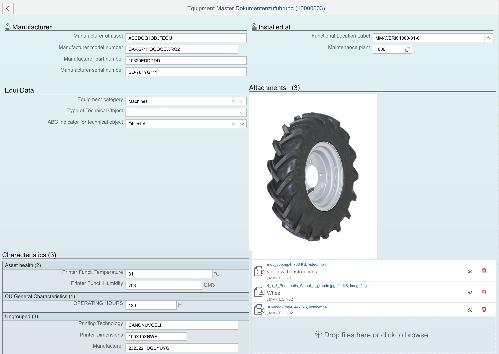

# Sample Application Code

- Built with [abap-api-tools](https://github.com/SAP/fundamental-tools) and [Aurelia](https://aurelia.io/) ui framework
- Live: http://coevi76/plm3 from Walldorf VPN only !

## Code Sections

- [Server](server/serve.py)

- [Payloads](http-payloads)

  - [Login](http-payloads/login)
  - [Equipment](http-payloads/equipment)
  - [Service Notification](http-payloads/service_notification)

- Frontend

  - Core reuse components
    - [Inputs](client/src/resources/elements/inputs)
    - [Custom Attributes](client/src/resources/attributes)
    - [Value Converters](client/src/resources/value-converters)
    - [Utilities](client/src/resources/utils)
  - Application reuse components
    - [Document Flow](client/src/reuse/docflow)
    - [Attachments](client/src/reuse/attachments)
    - [Dialog](client/src/reuse/dialog)
  - Appplication
    - [Shell](client/src/plm/shell)
    - [Routes](client/src/plm/app.js)
    - View-Models
      - [Login and User Info](client/src/login)
      - [Service Notification](client/src/plm/service-notification)
      - [Service Order](client/src/plm/service-order)
      - [Equipment](client/src/plm/equipment)
      - [Super-App](client/src/plm/super-app)
      - SAP Classification (CA-CL) Characteristics
        - [View](client/src/plm/equipment/view.html#L124)
        - [Model](client/src/plm/equipment/model.js#L86)
