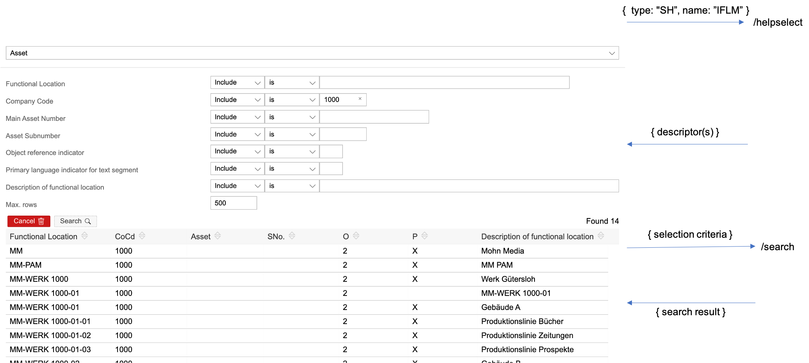

# Generic ABAP Value Helps<!-- omit in toc -->

Generic ABAP Value Helps comprises of four common layers of [pattern based applications](https://github.com/SAP/fundamental-tools/blob/main/doc/app.md)

- [How it works](#how-it-works)
- [ABAP API](#abap-api)
- [Server](#server)
- [View-Model and View](#view-model-and-view)

## How it works

Value Help is enabled for the ui component by binding custom attribute `shlp` to Value Help id like  `{type: 'SH', id: 'IFLM'}`:

```html
 <ui-input ddic-length="40" ddic-type="CHAR" label="Functional Location Label"
  value.bind="equipment.ES_SPECIFIC.READ_FLOC"
  shlp.bind="{type: 'SH', id: 'IFLM'}" mid="IFL">
</ui-input>
```

It turns the ui component:


into Value Help enabled ui component:


On Value Help user request (keyboard or click on icon), the Value Help dialog is presented, to capture the selection criteria (user input). The selection criteria is then passed to Value Help generic search service and the search result returned back to the dialog. User can cancel or confirm one search result value, to be captured as ui component input.

Combo box is the default ui representation of data elements with Fixed Domain Values or Check Table (CT) Value Input type. Instead of the dialog, value list coming from the same generic ABAP API is shown in a drop-down:


## ABAP API

Generic ABAP API exposes:

- Value Help descriptors, used for dynamic selection forms' creation
- Search service, returning the search result based on selection criteria (user input)

[API example](./abap/README.md)

## Server

- [index.js](./server/index.js)

- Check unit tests for [data structures'](https://github.com/SAP/fundamental-tools/tree/main/abap-value-help/tests/data) details

Server routes can be tested by REST client JSON payloads, or from any web browser, in which case hardcoded requests are sent to ABAP system:

```shell
cd server
npm install
node index

ABAP Value Help server ready:
http://localhost:3000/login
http://localhost:3000/fieldvalues
http://localhost:3000/helpselect
http://localhost:3000/search
http://localhost:3000/logout
```



## View-Model and View

Value Input dialog is dynamically created, based on so called Value Help descriptors. One descriptor describes one "elementary" Value Help and array of descriptors describes a "composite" Value Help. The dialog is identical for both, except the composite Value Help has one dropdown ui element at the top (combo box) to select one particular elementary Value Help, for selection and search.

Aurelia View and View-Model implementation require ca 300 lines of code in total and is portable to other ui frameworks:

[view-model](./dialog/ui-search-help.js)

[view](./dialog/ui-search-help.html)
