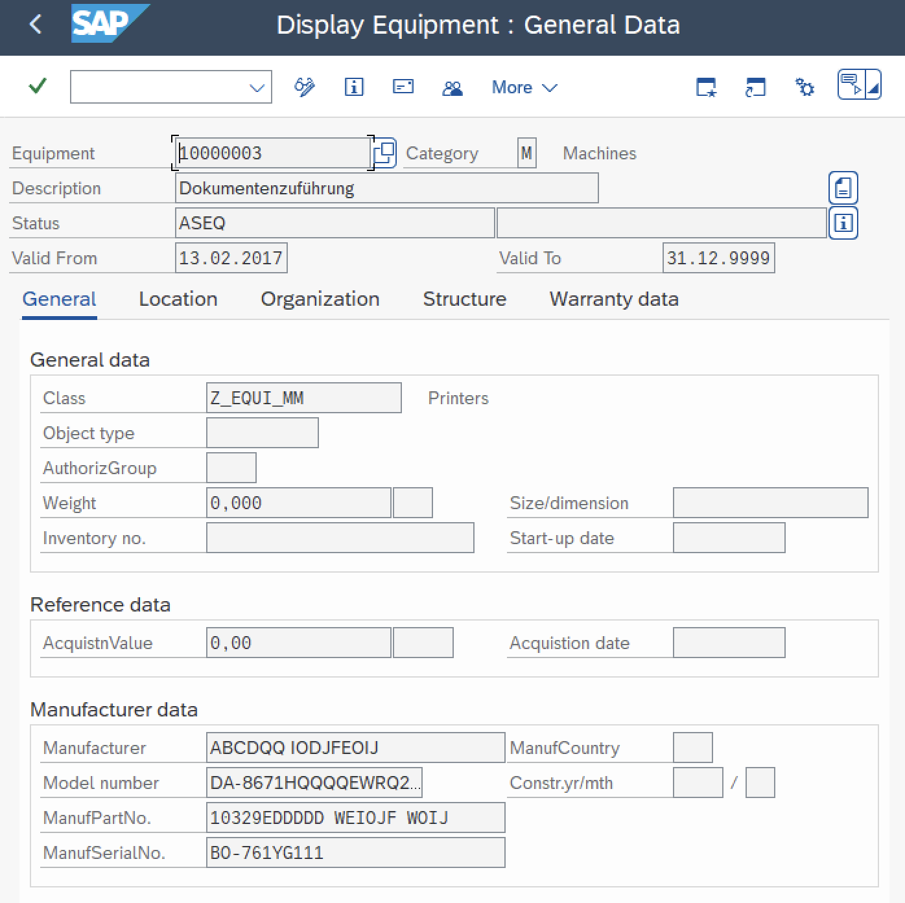
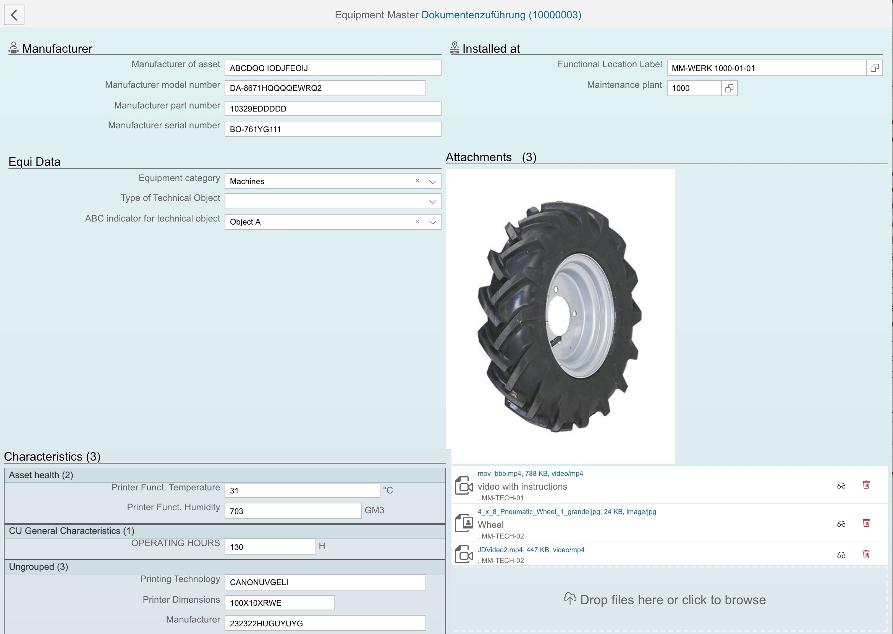
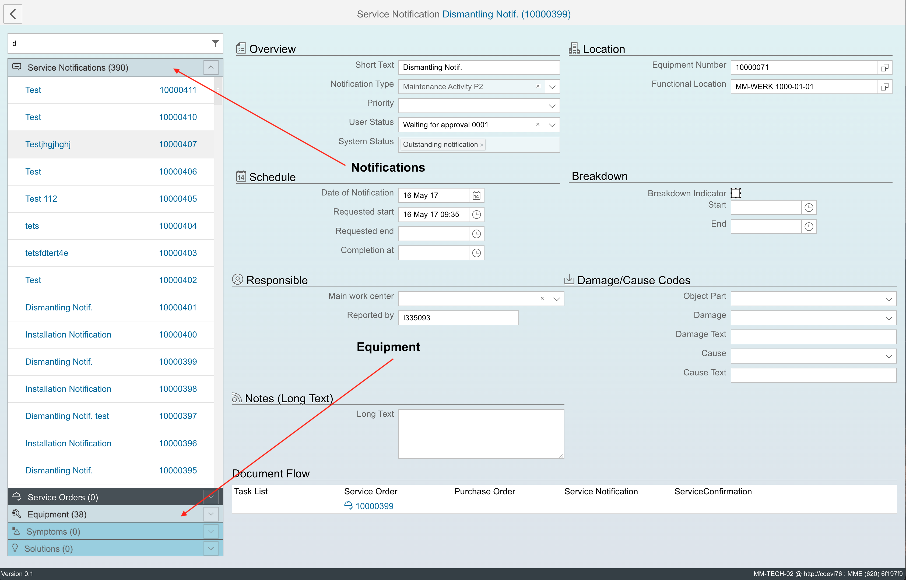

# Cloud extensions using Fundamental Library for ABAP <!-- omit in toc -->

Assume the scenario in which Functional Consultant together with customer defined how one or more ABAP transactions with old UI could be replaced with more convenient and effective app.

In this example, app shall be used to maintain Equipment, with Variant Characteristics, as alternative to old UI:



The new UI with same functionality ([live @ coevi76/plm3](http://coevi76/plm3) (SAP VPN url)) looks like this:



The transition from old to new UI, using SAP Fundamental Library for ABAP, is done in 4 steps, providing four components of new cloud extension app: ABAP API, App Server, View Model and View.

Let build these four layers, with the little help of [`abap` CLI tool](https://www.npmjs.com/package/abap-api-tools):

- [ABAP API](#abap-api) exposed as a set of remote-enabled Function Modules (RFMs)
- [App server](#app-server-java-node-python), expose ABAP API via app server routes
- [View Model](#view-model-js), consume server routes and run the frontend logic (browser)
- [View](#view-html-or-js), ui components, rendering the View Model (browser)
- [Value Helps](#value-helps)
- [Low code by design](#low-code-by-design)
- [Deployment options](#deployment-options)
- [Super Apps](#super-apps)
- [Users solutions](#users-solutions)

## ABAP API

Functional Consultant starts with *functional mockup*, describing bussiness functions to be provided in new UI. Together with ABAP developer BAPIs or other ABAP building modules are identified, providing required business functions. The functional mockup can be drawn on paper or old UI elements' screenshots can be used in Excel, Powerpoint, design tools etc. Tasks of this first step are:

- Clarify app functional requirementa and localize ABAP business logic
- Expose the business logic via remote-enabled Function Modules (ABAP API)
- Write ABAP API endpoints' names into `my-app.yaml` file (used later)

Assume ABAP endpoints below provide the business logic for our example

`my-app.yaml`

```yaml
equipment:
  - BAPI_EQUI_CHANGE # Change Equipment
  - BAPI_EQUI_CREATE # Create Equipment
  - BAPI_EQUI_CREATE_BY_REFERENCE # Anlegen Equipment mit Vorlageequipment
  - BAPI_EQUI_DISMANTLE # Install Equipment (Functional Location, Superior Equipment)
  - BAPI_EQUI_GETDETAIL # Read Equipment
  - BAPI_EQUI_GETLIST # Selection of Equipment List
  - BAPI_EQUI_GETSTATUS # Read (System-/User-)Status Equi
  - BAPI_EQUI_INSTALL # Install Equipment (Functional Location, Superior Equipment)
```

Cloud/web knowledge and skills are not mandatory here, it is regular ABAP development, like the ui will be implemented in ABAP.

## App Server (Java, Node, Python)

The next steps are server routes, exposing ABAP API. The example below is implemented with Python Flask, exposing ABAP API for Equipment maintenance app.

The NodeJS or Java code is almost identical and data mappings work the same way:

| ABAP      | Node                      | Python                | Example                                                                                                                                                                |
| --------- | ------------------------- | --------------------- | ---------------------------------------------------------------------------------------------------------------------------------------------------------------------- |
| Variable  | Variable                  | Variable              |                                                                                                                                                                        |
| Structure | Plain JS object           | Python dictionary     | `{ INSTDATE: ”20180327”, EQUI: “1000485” …}`                                                                                                                           |
| Table     | Array of JS plain objects | Array of Python dicts | `[`<br>&nbsp;&nbsp;&nbsp;&nbsp;```{ INSTDATE: ”20180327”, EQUI: “1000485” …}```,<br>&nbsp;&nbsp;&nbsp;&nbsp;```{ INSTDATE: ”20200912”, EQUI: “1000486” …}``` … <br>`]` |

The app server pattern depends on ABAP API and app requirements and may look like below. Full source is in SAP VPN [plm/equipment/app-server](https://github.wdf.sap.corp/ng-apps/plm3/blob/master/server/serve.py#L157)

```python
# Equipment
@app.route('/equipment/<path:path>', methods=['POST'])
def equipment(path):
    try:
        req = json.loads(request.data)

        if path == 'get':
            res = client.call('BAPI_EQUI_GETDETAIL', req)
        elif path == 'getlist':
            res = client.call('BAPI_EQUI_GETLIST', req)
        elif path == 'change':
            res = client.call('BAPI_EQUI_CHANG', req)
        elif path == 'install':
            res = client.call('BAPI_EQUI_INSTALL', req)
        elif path == 'dismantle':
            res = client.call('BAPI_EQUI_DISMANTLE', req)
        else:
            raise Exception('not implemented: %s' % path)

        return to_json(res)

    except Exception as e:
        return serverError(e), 500
```

- App server is RFC connected with ABAP system and the programming model is therefore still ABAP, with ABAP data structures, only in another programming language.
- Nice opportunity for ABAP developers to start with NodeJS, Python or Java
- By default ABAP stateful, COMMIT BAPI can be invoked after CHANGE BAPI for example
- ABAP API adaptations, extensions, choreography, orchestration, caching etc. can be added here, covering industry or customer specific requirements
- The server logic sometimes need access to ABAP data stuctures at field level. `abap` CLI [call templates](../abap-api-tools/README.md#abap-function-module-call-template) can help here.

## View Model (JS)

Via server routes, ABAP data structures reach the View-Model of your preferred ui framework. The programming language is now JavaScript and the business logic processing can be also here done the ABAP way. Calling BAPI COMMIT after BAPI CHANGE still possible for example, via server routes now.

- Modern JavaScript makes also this layer doable by ABAP developers interested in JavaScript
- One the same logic can run on app server or View Model level. With Node.js servers, even the same code can be moved back and forth, between app server and view model.

The view-model pattern depends on ABAP API and app requirements, may look like below. The full source of this example is in SAP VPN [plm/equipment/view-model](https://github.wdf.sap.corp/ng-apps/plm3/blob/master/client/src/plm/equipment/model.js)

```typescript
import { UIApp, UIHttp, UIUtils } from '../../resources/index';

export class Equipment {
  static inject = [UIApplication, UIHttpService];
  static __bizDocType = 'BUSEQUI';
  constructor(app, httpService) {
    this.app = app;
    this.httpService = httpService;
    this.reset();
  }

  getlist() {
    this.list = [];
    return this.httpService
      .backend('/equipment/getlist', {
        IV_PLANT: '1000'
      })
      .then(FROM_ABAP => {
        this.list = FROM_ABAP.ET_EQUIPMENT;
      })
      .catch(error => {
        this.reset();
        this.app.toastError(error);
      });
  }

  save() {
    // set X-fields
    let header = [
      'MANFACTURE',
      'MANMODEL',
      'MANPARNO',
      'MANSERNO',
      'MAINTPLANT',
      'OBJECTTYPE',
      'ABCINDIC',
      'WORK_CTR'
    ];
    let specific = ['EQUICATGRY', 'READ_FLOC'];
    this.IS_HEADER_X = UIUtils.abapStructDiff(this.ES_HEADER, this.IS_HEADER, header);
    this.IS_SPECIFIC_X = UIUtils.abapStructDiff(this.ES_SPECIFIC, this.IS_SPECIFIC, specific);
    // characteristics
    let itChar = [];
    for (let chGroup of this.Characteristics) {
      for (let ch of chGroup.CHARLIST) {
        itChar.push({
          CLASS: ch.CLASS,
          CHARACT: ch.NAME_CHAR,
          VALUE: ch.VALUE,
          VALUE_FROM: ch.VALUE_FROM,
          VALUE_TO: ch.VALUE_TO
        });
      }
    }

// get ...
```

View Model initializers of ABAP data structures are automatically generated by `abap` CLI and can be used in app server or View Model logic, for fields' level processing.

```JavaScript
//
// INPUT PARAMETERS
//

// DATA_FLEET BAPI_FLEET Vehicle-Specific Data

/* eslint-disable key-spacing */
// prettier-ignore
DATA_FLEET = {
  CARD_NUM                      : '',  // Fuel card number
  CHASSIS_NUM                   : '',  // Chassis number
  DIM_UNIT_ISO                  : '',  // ISO code for unit of measurement
  ENGINE_CAP                    : 0,  // Engine capacity
  ENGINE_CYL                    : '',  // Number of cylinders
  ENGINE_POWER                  : 0,  // Power at specific number of revolutions per minute
  ENGINE_SNR                    : '',  // Engine serial number of manufacturer
  FLEET_LEN                     : 0,  // Maximum fleet object length
```

## View (HTML or JS)

HTML or JS Views comprise of generic ui components, grouped together into frontend layout elements.


Ui components are bound to View Model data from app server routes, thus ABAP data. Ui components' can be therefore generated using `abap` CLI [get](../abap-api-tools/README.md#abap-api-annotations-for-ui-elements) and [make](../abap-api-tools/README.md#ui-elements) commands and reused in Views, with or without adaptations:

```shell
abap make aurelia -c my-app # from the first ABAP API step above
```

`abap make` use is optional. Ui components can be manually coded from scratch and generated app components can be changed, like add/remove SU3 id, value input help etc.

- ABAP developers can build also this layer, by reusing (copy/paste) standard patterns for components positioning and grouping. Learning a bit more about HTML/JS, developers can start modifying standard patterns and buil their own.

- Standard ui components' templates (default ui configurations) can be pure HTML, pure JS or the combination of both. It depends on ui framework and standard usage pattern can be easy changed (custom ui configurations).

Example with input, datepicker and checkbox:

```html
<section class="fd-section">
    <ui-input value.bind="DATA_GENERAL.DISTR_CHAN" shlp.bind='{"type":"SH", "id":"CSH_TVTW"}'
        data-abap.bind='{"ddic":"CHAR", "type":"string", "length":"2", "mid":"VTW"}'
        label="Distribution Channel">
    </ui-input>

    <ui-checkbox value.bind="DATA_SPECIFIC.READ_CUREF" label="Referenced Configuration"></ui-checkbox>

    <ui-date date.bind="DATA_FLEET.EXPIRY_DATE" label="Validity end date"></ui-date>
</section>
```

More examples: [SAP-samples/node-rfc-samples/fundamental-tools](https://github.com/SAP-samples/node-rfc-samples/tree/main/fundamental-tools)

## Value Helps

Generic and custom Value Helps can be added to any ui component using `shlp` custom attribute: [abap-value-help](../abap-value-help/README.md)

Default Value Helps are added as ui components markup, automatically generated by `abap` CLI.

Value Helps are exposed in run-time, using `abap-value-help` component and consumed by ui components with Value Help markup.

```html
<!-- Fixed Domain Values -->
<ui-input data-abap.bind="{ddic:'CHAR', type:'string', length:1}" label="Partial/Final Confirmation"
  value.bind="serviceOrder.confirmation.FIN_CONF"
  shlp.bind="{type:'FV', id:'AUERU_VS'}"
></ui-input>

<!-- Check Tables -->
<ui-combo clear ddic-length="1" ddic-type="CHAR" mid="EQT" label="Equipment category"
  value.bind="equipment.ES_SPECIFIC.EQUICATGRY"
  shlp.bind="{type: 'CT', id: 'T370T'}"
></ui-combo>

<!-- Complex/Elementary Helps Search Helps -->
<ui-input ddic-length="18" ddic-type="CHAR" label="Equipment #"
  value.bind="installDetail.equiId"
  shlp.bind="{type: 'SH', id: 'EQUI', blacklist: 'SH EQUIR', autoselect: 'SH EQUIT'}"
></ui-input>
```

## Low code by design

Fully functional app shown below, is implemented with ca. 400 lines of code:

| App Component                 |     LoC |
| ----------------------------- | ------: |
| App Server (Node/Java/Python) |      20 |
| View Model (ES/TS)            |     213 |
| View (HTML)                   |     172 |
| **Total**                     | **405** |

Features:

- Equipment read/update
- Grouped and ungrouped Classifications/Characteristics read/update
- Attachments preview/upload/download

The implementation is under full developer's control, without any magic added by `abap` CLI and without run-time dependencies of this toolkit, except for inevitable Value Helps.


## Deployment options

Apps can be deployed on-premise or in the cloud, as follows


RFC connectivity is supported via [SAP Cloud Connector](https://help.sap.com/docs/connectivity/sap-btp-connectivity-cf/cloud-connector) run-time platforms

- Java, all use-cases
- Node.js and Python, use-cases described in [Additional rules and info for NW RFC SDK, pt. 12](https://wiki.one.int.sap/wiki/display/PIC/UsingConnectors) (SAP VPN url)

For cloud use-cases not listed in pt. 12 above, [SAP Business Connector](https://support.sap.com/en/product/connectors/bc.html) can be used, as described [here](https://github.com/SAP/node-rfc/issues/212#issuecomment-829090667), in addition to alternatives described in same comment.

Local development can be by using SAP connectors for [Python](https://github.com/SAP/PyRFC), [Node.js](https://github.com/SAP/node-rfc) or [Java](https://support.sap.com/en/product/connectors/jco.html)

## Super Apps

Althoug already powerfull, the Equipment maintenance app with Variant Characteristics and Documents Management, is far from limits of what this approach can handle.

When developed this way, more apps can be assembled into super-apps, without noticable impact on performance or maintainability.

The example below is probably unique case implemented with SAP technologies, a cockpit super-app, assembled from Service Notifications, Service Orders and Equipment Maintenance "elementary" apps, all without iframes.



## Users solutions

Users' solution you find in web may work fine but NOT supported by this project, like [SAP RFC to S3 using AWS Lambda](https://catalog.us-east-1.prod.workshops.aws/workshops/79435b9d-cf2e-4afc-a3f6-4eceeaf0865d/en-US/aws-datalakes-for-sap/application-level/2-3-sap-rfc) ...
