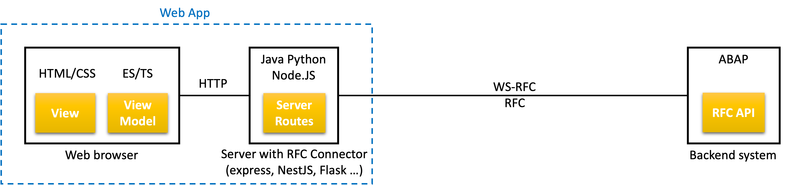

# Build cloud extension using Fundamental Library for ABAP <!-- omit in toc -->

Assume the scenario in one or more ABAP transactions should be replaced with more convenient and effective web application.

In this example, app shall be used to maintain Equipment, as alternative to old Dynpro screens


The screenshot below illustrates required functionality. It is taken from already implemented app, running on [coevi76/plm3](http://coevi76/plm3) (SAP VPN Walldorf only):


It comprises of four components shown in deployment diagram: ABAP API, App Server, View Model and View



Let build and put these pieces together, using [`abap` CLI tool](https://www.npmjs.com/package/abap-api-tools) and Aurelia web framework served by Python Flak server.

- [ABAP API](#abap-api)
  - [Features](#features)
  - [API](#api)
- [App Server](#app-server)
- [View Model (JS)](#view-model-js)
- [View (HTML or JS)](#view-html-or-js)
- [Value Helps](#value-helps)
- [Low code by design](#low-code-by-design)
- [Super Apps](#super-apps)

## ABAP API

Customer and Functional Consultant start with *functional mockup*, describing bussiness functions to supported by app. With the help of ABAP developer, ABAP modules providing required business logic are localized - either already encapsulated in BAPIs and RFMs, or in modules to be wrapped into RFMs.

Functional mockup can be sketched on paper or using Dynpro screenshots arranged in Excel, Powerpoint, Figma and other design tool. Tasks of this first step are:

- Clarify app functional requirementa and localize ABAP business logic
- Expose the business logic via ABAP RFMs (ABAP API)
- Write ABAP RFM names into `config/api.equipment.yaml`

### Features

Requirements in our case are:

- Equipment read/update
- Grouped and ungrouped Classifications/Characteristics read/update
- Show MTTR/MTBF times
- Attachments preview/upload/download

### API

ABAP API is localized in already existing BAPIs and wrapped RFMs, providing some more flexibility and custom capabilities, like reading MTTTR/MTBF times

`config/api.equipment.yaml`

```yaml
api.equipment:
  - /COE/RBP_PAM_EQUIPMENT_GETL # Selection of Equipment List
  - /COE/RBP_PAM_EQUIPMENT_GET # Read Equipment
  - /COE/RBP_PAM_EQUIPMENT_CHANGE # Change Equipment
  - /COE/RBP_PAM_EQUIPMENT_INSTALL # Install Equipment (Functional Location, Superior Equipment)
  - /COE/RBP_PAM_EQUIPMENT_DISMTLE # Dismantle Equipment (Functional Location, Superior Equipment)
  - /COE/RBP_PAM_EQUIP_HIER_GET # Read Equipment installation hierarchy
  - BAPI_EQUI_CREATE # Create Equipment
```

## App Server

The next step are server route to exposing these RFMs. As no additional logic required on server, ABAP data are just passed forth and back, without orchestration.

The example below is implemented with Python Flask and looks almost identical in Node.JS or Java server. Also data mappings work the same way:

| ABAP      | Node                      | Python                | Example                                                                                                                                                                |
| --------- | ------------------------- | --------------------- | ---------------------------------------------------------------------------------------------------------------------------------------------------------------------- |
| Variable  | Variable                  | Variable              |                                                                                                                                                                        |
| Structure | Plain JS object           | Python dictionary     | `{ INSTDATE: ”20180327”, EQUI: “1000485” …}`                                                                                                                           |
| Table     | Array of JS plain objects | Array of Python dicts | `[`<br>&nbsp;&nbsp;&nbsp;&nbsp;```{ INSTDATE: ”20180327”, EQUI: “1000485” …}```,<br>&nbsp;&nbsp;&nbsp;&nbsp;```{ INSTDATE: ”20200912”, EQUI: “1000486” …}``` … <br>`]` |

The app server pattern depends on ABAP API and app requirements and here is the source code [server/server.py#L48](https://github.com/SAP/fundamental-tools/blob/main/abap-api-tools/web-application-code-explorer/server/serve.py#L48)

```python
# Equipment
@app.route('/equipment/<path:path>', methods=['POST'])
def equipment(path):
    try:
        payload = json.loads(request.data)

        if path == 'get':
            result = connection_pool.worker('PAM_EQUIPMENT_GET', payload)
        elif path == 'getlist':
            result = connection_pool.worker('PAM_EQUIPMENT_GETL', payload)
        elif path == 'change':
            result = connection_pool.worker('PAM_EQUIPMENT_CHANGE', payload)
        elif path == 'install':
            result = connection_pool.worker('PAM_EQUIPMENT_INSTALL', payload)
        elif path == 'dismantle':
            result = connection_pool.worker('PAM_EQUIPMENT_DISMTLE', payload)
        else:
            raise Exception ('not implemented: %s' % path)

        return to_json(result)

    except Exception as ex:
        return serverError(e), 500
```

Let trace one HTTP request/response cycle, using `equipment/get` route for example, used by frontend to read Equipment data from ABAP system

The frontend works with ABAP data in JavaScript and sends the equipment number as ABAP API `IV_EQUIID` parameter in HTTP POST request

```http
POST coevi76/plm3/api/equipment/get
Content-Type: application/json

{"IV_EQUIID": 4711}
```

Using `json.loads()`, ABAP request data are transformed from JSON to Python dictionary `{"IV_EQUIID": 4711}`, like Node.JS or Java plain object, and sent to ABAP RFM PAM_EQUIPMENT_GET, to read Equipment data.

The RFC connector, encapsulated in `connection_pool.worker()`, automatically transforms Python data to ABAP, invokes `PLM_EQUIPMENT_GET` and returns ABAP Equipment data in Python format, in variable `result`. The `result` response is sent to web brower as JSON using `to_json(result)`.

In this scenario

- ABAP data go all the way up to app server and frontend. All application layers work with the same ABAP data model, only in different formats. App server works with ABAP data in Python, frontend with ABAP data in JavaScript and ABAP works with ABAP :)
- It simplifies the development and troubleshoting
- The programming model is "standard" ABAP, like the UI is built in ABAP, which is a nice opportunity for ABAP developers to apply ABAP knowledge in new platforms: Java, Node.JS, Python, JavaScript
- Application is ABAP stateful by default (configuration), thus COMMIT BAPI shall be invoked after CHANGE BAPI for example. In this example BAPIs are wrapped into application specific RFMs, including COMMITs
- ABAP API adaptations, extensions, choreography, orchestration, caching etc. can be added at server level, if needed, covering industry or customer specific requirements
- The server logic sometimes need access to ABAP data stuctures at field level, in which case `abap` CLI [call templates](../abap-api-tools/README.md#abap-function-module-call-template) can help.
- The very high performance of this approach makes apps look like clickable demo while working with real ABAP system and in applications done so far the hourglass was never needed

## View Model (JS)

Via server routes, ABAP data reach the frontend View-Model. The programming language is now JavaScript and the orchestration can be done also at this level, the ABAP way. Calling BAPI COMMIT after BAPI CHANGE still possible for example, via server routes now.

- Modern object oriented and strongly typed JavaScript makes also this layer doable by ABAP developers interested in JavaScript
- The same logic can be implemented either in app server or in View-Model, depending on scenario. In case of Node.JS servers even using the same JavaScript code.

The View-Model pattern depends on ABAP API and app requirements and in our application looks like below. Here the source code [client/src/plm/equipment/model.js](https://github.com/SAP/fundamental-tools/blob/main/abap-api-tools/web-application-code-explorer/client/src/plm/equipment/model.js)

```typescript
import { UIApp, UIHttp, UIUtils } from '../../resources/index';

export class Equipment {
  static inject = [UIApplication, UIHttpService];
  static __bizDocType = 'BUSEQUI';
  constructor(app, httpService) {
    this.app = app;
    this.httpService = httpService;
    this.reset();
  }

  getlist() {
    this.list = [];
    return this.httpService
      .backend('/equipment/getlist', {
        IV_PLANT: '1000'
      })
      .then(FROM_ABAP => {
        this.list = FROM_ABAP.ET_EQUIPMENT;
      })
      .catch(error => {
        this.reset();
        this.app.toastError(error);
      });
  }

  save() {
    // set X-fields
    let header = [
      'MANFACTURE',
      'MANMODEL',
      'MANPARNO',
      'MANSERNO',
      'MAINTPLANT',
      'OBJECTTYPE',
      'ABCINDIC',
      'WORK_CTR'
    ];
    let specific = ['EQUICATGRY', 'READ_FLOC'];
    this.IS_HEADER_X = UIUtils.abapStructDiff(this.ES_HEADER, this.IS_HEADER, header);
    this.IS_SPECIFIC_X = UIUtils.abapStructDiff(this.ES_SPECIFIC, this.IS_SPECIFIC, specific);
    // characteristics
    let itChar = [];
    for (let chGroup of this.Characteristics) {
      for (let ch of chGroup.CHARLIST) {
        itChar.push({
          CLASS: ch.CLASS,
          CHARACT: ch.NAME_CHAR,
          VALUE: ch.VALUE,
          VALUE_FROM: ch.VALUE_FROM,
          VALUE_TO: ch.VALUE_TO
        });
      }
    }

// get ...
```

View Model initializers of ABAP data structures are automatically generated by `abap` CLI and can be used in app server or View Model logic, for fields' level processing, adapted if needed.

```JavaScript
//
// INPUT PARAMETERS
//

// DATA_FLEET BAPI_FLEET Vehicle-Specific Data

/* eslint-disable key-spacing */
// prettier-ignore
DATA_FLEET = {
  CARD_NUM                      : '',  // Fuel card number
  CHASSIS_NUM                   : '',  // Chassis number
  DIM_UNIT_ISO                  : '',  // ISO code for unit of measurement
  ENGINE_CAP                    : 0,  // Engine capacity
  ENGINE_CYL                    : '',  // Number of cylinders
  ENGINE_POWER                  : 0,  // Power at specific number of revolutions per minute
  ENGINE_SNR                    : '',  // Engine serial number of manufacturer
  FLEET_LEN                     : 0,  // Maximum fleet object length
```

## View (HTML or JS)

HTML or JS Views comprise of web components, grouped together into frontend layout elements.


Ui components are bound to View Model data from app server routes, thus ABAP data. Ui components' can be therefore generated using `abap` CLI [get](../abap-api-tools/README.md#abap-api-annotations-for-ui-elements) and [make](../abap-api-tools/README.md#ui-elements) commands and reused in Views, with or without adaptations:

```shell
abap make aurelia -c config/api.equipment # from the first ABAP API step above
```

`abap make` use is optional. Ui components can be manually coded from scratch and generated app components can be changed, like add/remove attributes for SU3 id, value input help etc.

- ABAP developers can build also this layer, by reusing (copy/paste) standard patterns for components positioning and grouping. Learning a bit more about HTML/JS, developers can start modifying standard patterns and buil their own.

- Standard ui components' templates (default ui configurations) can be pure HTML, pure JS or the combination of both. It depends on ui framework and standard usage pattern can be easy changed (custom ui configurations).

Example with input, datepicker and checkbox:

```html
<section class="fd-section">
    <ui-input value.bind="DATA_GENERAL.DISTR_CHAN" shlp.bind='{"type":"SH", "id":"CSH_TVTW"}'
        data-abap.bind='{"ddic":"CHAR", "type":"string", "length":"2", "mid":"VTW"}'
        label="Distribution Channel">
    </ui-input>

    <ui-checkbox value.bind="DATA_SPECIFIC.READ_CUREF" label="Referenced Configuration"></ui-checkbox>

    <ui-date date.bind="DATA_FLEET.EXPIRY_DATE" label="Validity end date"></ui-date>
</section>
```

More examples: [SAP-samples/node-rfc-samples/fundamental-tools](https://github.com/SAP-samples/node-rfc-samples/tree/main/fundamental-tools)

## Value Helps

Generic and custom Value Helps can be added to any ui component using `shlp` custom attribute: [abap-value-help](../abap-value-help/README.md), like done in Aurelia Value Helps [client/src/resources/attributes/ui-lookup.js](https://github.com/SAP/fundamental-tools/blob/main/abap-api-tools/web-application-code-explorer/client/src/resources/attributes/ui-lookup.js)

Default Value Helps are added as ui components markup, automatically generated by `abap` CLI.

Value Helps are exposed via `abap-value-help` run-time API and consumed by ui components with Value Help custom attribute.

```html
<!-- Fixed Domain Values -->
<ui-input data-abap.bind="{ddic:'CHAR', type:'string', length:1}" label="Partial/Final Confirmation"
  value.bind="serviceOrder.confirmation.FIN_CONF"
  shlp.bind="{type:'FV', id:'AUERU_VS'}"
></ui-input>

<!-- Check Tables -->
<ui-combo clear ddic-length="1" ddic-type="CHAR" mid="EQT" label="Equipment category"
  value.bind="equipment.ES_SPECIFIC.EQUICATGRY"
  shlp.bind="{type: 'CT', id: 'T370T'}"
></ui-combo>

<!-- Complex/Elementary Helps Search Helps -->
<ui-input ddic-length="18" ddic-type="CHAR" label="Equipment #"
  value.bind="installDetail.equiId"
  shlp.bind="{type: 'SH', id: 'EQUI', blacklist: 'SH EQUIR', autoselect: 'SH EQUIT'}"
></ui-input>
```

## Low code by design

Fully functional app shown below, is implemented with ca. 400 lines of code, which  looks surprising little considering capabilities.

| App Component                                                                                                                                           |      LoC |
| ------------------------------------------------------------------------------------------------------------------------------------------------------- | -------: |
| [App Server (Node/Java/Python)](https://github.com/SAP/fundamental-tools/blob/main/abap-api-tools/web-application-code-explorer/server/serve.py#L48)    |       20 |
| [View Model (ES/TS)](https://github.com/SAP/fundamental-tools/blob/main/abap-api-tools/web-application-code-explorer/client/src/plm/equipment/model.js) |      192 |
| [View (HTML)](https://github.com/SAP/fundamental-tools/blob/main/abap-api-tools/web-application-code-explorer/client/src/plm/equipment/view.html)       |      150 |
| **Total**                                                                                                                                               | **~400** |

The low-code is here achieved by design and simplification at each level (frontend/server/backend). Standard web best-practices is combined with classical ABAP best practices, without "mediators" in between.

Some comparisons with other technologies show around 98% less code (40-50 times) needed at ABAP level, because the plain ABAP business logic is exposed, practically without overhead. Around 92% less code (10-20 times) is required at Web level, by straightforward ABAP data consumption, with ui components in design time enriched by ABAP metadata.

The simplicity of this approach makes the development of these apps quite fun. Results come up quickly and developers see only application code, not bloated with code of frameworks and other technical artefacts.

The implementation is under full developer's control, without any magic added by `abap` CLI and without run-time dependencies of this toolkit, except for inevitable Value Helps.


## Super Apps

Alhough already powerful, the Equipment maintenance app is far from limits of what this approach can handle.

When developed this way, more apps can be assembled into so called super-apps, without noticable impact on performance or maintainability.

The example below is probably unique case implemented with SAP technologies, a cockpit super-app, assembled from Service Notifications, Service Orders and Equipment Maintenance "elementary" apps, all without iframes: [client/src/plm/super-app/app.html](https://github.com/SAP/fundamental-tools/blob/main/abap-api-tools/web-application-code-explorer/client/src/plm/super-app/app.html)


