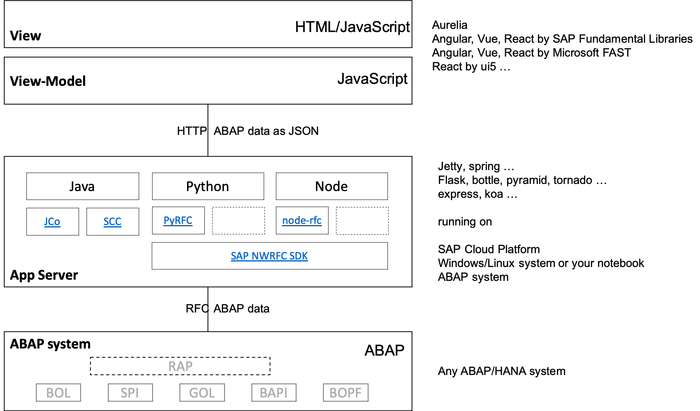
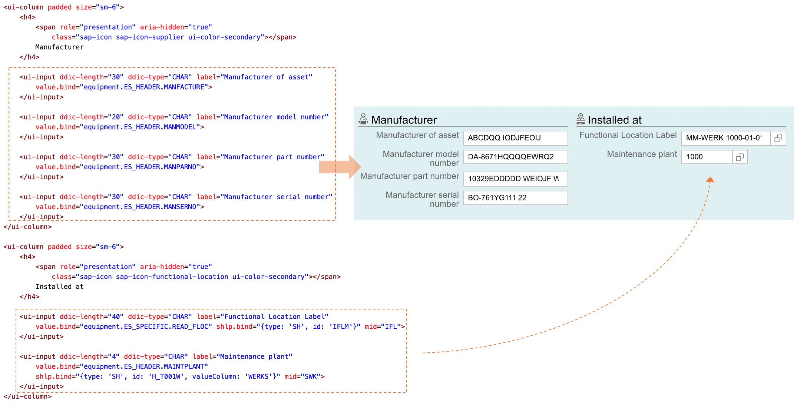

# Building an app<!-- omit in toc -->

Pattern based apps solve complex problems by re-usable patterns, rather than using complex frameworks.

Without frameworks in between you and your application, what remains are re-usable code-patterns and basic programming skills of JavaScript or ABAP, you can start with.

- [Why Patterns?](#why-patterns)
- [Technical Landscape](#technical-landscape)
- [Components](#components)
  - [ABAP API](#abap-api)
  - [App Server (Java, Node, Python)](#app-server-java-node-python)
  - [View Model (JS)](#view-model-js)
  - [View (HTML or JS)](#view-html-or-js)
- [App = ABAP API + Server Model + View Model + View](#app--abap-api--server-model--view-model--view)
- [Deployment options](#deployment-options)

## Why Patterns?

- Pattern based model results in so little code, that pattern copy & adapt appears more handy than learning, configuring and modifying a "wizzard" or generator like "master/detail", doing the same.
- Diversity requirements is hard to cover by generic framework, wizzard, generator ...
- The model works the same way with any ui framework. Mostly used with standards-based [Aurelia](https://aurelia.io/), which is
  - Based on simple conventions, easy to learn
  - Practically invisible in applications, developers can entirely focus on application, not the framework
  - Support other ui frameworks' templating systems

## Technical Landscape



- SAP standard products:
  - [JCo](https://support.sap.com/en/product/connectors/jco.html)
  - [SCC for Java](https://help.sap.com/viewer/cca91383641e40ffbe03bdc78f00f681/LATEST/en-US/e6c7616abb5710148cfcf3e75d96d596.html)
- SAP open source based on standard product [SAP NWRFC SDK](https://support.sap.com/en/product/connectors/nwrfcsdk.html)
  - [PyRFC](https://github.com/SAP/PyRFC)
  - [node-rfc](https://github.com/SAP/node-rfc)


## Components

Apps comprise of four main components or levels:

- ABAP API exposed as a set of remote-enabled Function Modules (RFMs)
- Java/NodeJS/Python app server, like express, Flask, Jetty etc., mapping ABAP API to server routes
- JS View Model, consuming server routes (browser)
- HTML or JS View, rendering the View Model

Let build these four layers, with the little help of [`abap` CLI tool](https://www.npmjs.com/package/abap-api-tools):

### ABAP API

- Localize the ABAP business logic for app functional requirements
- Expose it via remote-enabled Function Modules
- Write API names into `my-app.yaml` file (used later)

`my-app.yaml`

```yaml
equipment:
  - BAPI_EQUI_CHANGE # Change Equipment
  - BAPI_EQUI_CREATE # Create Equipment
  - BAPI_EQUI_CREATE_BY_REFERENCE # Anlegen Equipment mit Vorlageequipment
  - BAPI_EQUI_DISMANTLE # Install Equipment (Functional Location, Superior Equipment)
  - BAPI_EQUI_GETDETAIL # Read Equipment
  - BAPI_EQUI_GETLIST # Selection of Equipment List
  - BAPI_EQUI_GETSTATUS # Read (System-/User-)Status Equi
  - BAPI_EQUI_INSTALL # Install Equipment (Functional Location, Superior Equipment)
```

Cloud/web knowledge and skills are not required here.

Just a regular ABAP development, like the ui will be implemented in ABAP.

### App Server (Java, Node, Python)

The example below shows Python Flask server, exposing ABAP API for Equipment maintenance app.

The NodeJS or Java code is almost identical and data mappings work the same way:

| ABAP      | Node                      | Python                | Example                                                                                                                                                                |
| --------- | ------------------------- | --------------------- | ---------------------------------------------------------------------------------------------------------------------------------------------------------------------- |
| Variable  | Variable                  | Variable              |                                                                                                                                                                        |
| Structure | Plain JS object           | Python dictionary     | `{ INSTDATE: ”20180327”, EQUI: “1000485” …}`                                                                                                                           |
| Table     | Array of JS plain objects | Array of Python dicts | `[`<br>&nbsp;&nbsp;&nbsp;&nbsp;```{ INSTDATE: ”20180327”, EQUI: “1000485” …}```,<br>&nbsp;&nbsp;&nbsp;&nbsp;```{ INSTDATE: ”20200912”, EQUI: “1000486” …}``` … <br>`]` |

```python
# Equipment
@app.route('/equipment/<path:path>', methods=['POST'])
def equipment(path):
    try:
        payload = json.loads(request.data)

        if path == 'get':
            result = client.call('BAPI_EQUI_GETDETAIL', payload)
        elif path == 'getlist':
            result = client.call('BAPI_EQUI_GETLIST', payload)
        elif path == 'change':
            result = client.call('BAPI_EQUI_CHANG', payload)
        elif path == 'install':
            result = client.call('BAPI_EQUI_INSTALL', payload)
        elif path == 'dismantle':
            result = client.call('BAPI_EQUI_DISMANTLE', payload)
        else:
            raise Exception('not implemented: %s' % path)

        return to_json(result)

    except Exception as e:
        return serverError(e), 500
```

- App server is RFC connected with ABAP system and the programming model is therefore still ABAP, with ABAP data structures, only in another programming language.

- Nice opportunity for ABAP developers to start with NodeJS, Python or Java

- By default ABAP stateful, COMMIT BAPI can be invoked after CHANGE BAPI for example

- ABAP API adaptations, extensions, choreography, orchestration, caching etc. can be added here, covering industry or customer specific requirements

- The server logic sometimes need access to ABAP data stuctures at field level. `abap` CLI [call templates](../abap-api-tools/README.md#abap-function-module-call-template) can help here.

### View Model (JS)

Via server routes, ABAP data structures reach the View-Model. The programming language is now JavaScript and the business logic processing can be also here done the ABAP way. Calling BAPI COMMIT after BAPI CHANGE still possible for example, via server routes now.

- Modern object oriented JavaScript makes also this layer doable by ABAP developers interested in JavaScript
- One the same logic can run on app server or View Model level. With JavaScript servers, even the same code can be shifted back and forth, between app server and view model.

The model pattern depends on ABAP API structure and app requirements, may look like this:

```JavaScript
import { UIApp, UIHttp, UIUtils } from '../../resources/index';

export class Equipment {
  static inject = [UIApplication, UIHttpService];
  static __bizDocType = 'BUSEQUI';
  constructor(app, httpService) {
    this.app = app;
    this.httpService = httpService;
    this.reset();
  }

  getlist() {
    this.list = [];
    return this.httpService
      .backend('/equipment/getlist', {
        IV_PLANT: '1000'
      })
      .then(FROM_ABAP => {
        this.list = FROM_ABAP.ET_EQUIPMENT;
      })
      .catch(error => {
        this.reset();
        this.app.toastError(error);
      });
  }

  save() {
    // set X-fields
    let header = [
      'MANFACTURE',
      'MANMODEL',
      'MANPARNO',
      'MANSERNO',
      'MAINTPLANT',
      'OBJECTTYPE',
      'ABCINDIC',
      'WORK_CTR'
    ];
    let specific = ['EQUICATGRY', 'READ_FLOC'];
    this.IS_HEADER_X = UIUtils.abapStructDiff(this.ES_HEADER, this.IS_HEADER, header);
    this.IS_SPECIFIC_X = UIUtils.abapStructDiff(this.ES_SPECIFIC, this.IS_SPECIFIC, specific);
    // characteristics
    let itChar = [];
    for (let chGroup of this.Characteristics) {
      for (let ch of chGroup.CHARLIST) {
        itChar.push({
          CLASS: ch.CLASS,
          CHARACT: ch.NAME_CHAR,
          VALUE: ch.VALUE,
          VALUE_FROM: ch.VALUE_FROM,
          VALUE_TO: ch.VALUE_TO
        });
      }
    }

// get ...
```

### View (HTML or JS)

HTML or JS Views comprise of generic ui components, grouped together into frontend layout elements.




ui components are bound to View Model data structures, which are ABAP data structures. Components' templates can be therefore generated using `abap` CLI [get](../abap-api-tools/README.md#abap-api-annotations-for-ui-elements) and [make](../abap-api-tools/README.md#ui-elements) commands and reused in Views, with or without adaptations:

```shell
abap make aurelia -c my-app # from the first ABAP API step above
```

`abap make` use is optional. Ui components can be manually coded from scratch and generated app components can be changed, like add/remove SU3 id, value input help etc.

- ABAP developers can build also this layer, by reusing (copy/paste) standard patterns for components positioning and grouping. Learning a bit more about HTML/JS, developers can start modifying standard patterns and buil their own.

- Standard ui components' templates (default ui configurations) can be pure HTML, pure JS or the combination of both. It depends on ui framework and standard usage pattern can be easy changed (custom ui configurations).

- Generic and custom Value Helps are supported by `shlp` custom attribute: [abap-value-help](../abap-value-help/README.md)

One example with input, datepicker and checkbox:

```html
<section class="fd-section">
    <ui-input value.bind="DATA_GENERAL.DISTR_CHAN" shlp.bind='{"type":"SH", "id":"CSH_TVTW"}'
        data-abap.bind='{"ddic":"CHAR", "type":"string", "length":"2", "mid":"VTW"}'
        label="Distribution Channel">
    </ui-input>

    <ui-checkbox value.bind="DATA_SPECIFIC.READ_CUREF" label="Referenced Configuration"></ui-checkbox>

    <ui-date date.bind="DATA_FLEET.EXPIRY_DATE" label="Validity end date"></ui-date>
</section>
```

JS files with View Model initializers of ABAP data structures can be used in app server or View Model logic, for fields' level processing.

```JavaScript
//
// INPUT PARAMETERS
//

// DATA_FLEET BAPI_FLEET Vehicle-Specific Data

/* eslint-disable key-spacing */
// prettier-ignore
DATA_FLEET = {
  CARD_NUM                      : '',  // Fuel card number
  CHASSIS_NUM                   : '',  // Chassis number
  CONSUMP_MOVE                  : '',  // Indicator Consumption Recording: Material Movement
  CONSUMP_TOL                   : '',  // Indicator Consumption Recording: Permitted Tolerances
  DIM_UNIT                      : '',  // Unit of length
  DIM_UNIT_ISO                  : '',  // ISO code for unit of measurement
  ENGINE_CAP                    : 0,  // Engine capacity
  ENGINE_CYL                    : '',  // Number of cylinders
  ENGINE_POWER                  : 0,  // Power at specific number of revolutions per minute
  ENGINE_SNR                    : '',  // Engine serial number of manufacturer
  ENGINE_TYPE                   : '',  // Engine type
  EXPIRY_DATE                   : '',  // Validity end date
  FLEET_HGT                     : 0,  // Maximum fleet object height
  FLEET_LEN                     : 0,  // Maximum fleet object length
```


## App = ABAP API + Server Model + View Model + View

Fully functional app shown below, is implemented with ca. 400 lines of code:

| App Component                   |     LoC |
| ------------------------------- | ------: |
| Server Model (Node/Java/Python) |      20 |
| View (HTML)                     |     172 |
| View Model (ES/TS)              |     213 |
| **Total**                       | **405** |

Features:

- Equipment read/update
- Grouped and ungrouped Classifications/Characteristics read/update
- Attachments preview/upload/download

The implementation is under full developer's control, without any magic added by `abap` CLI.


## Deployment options


